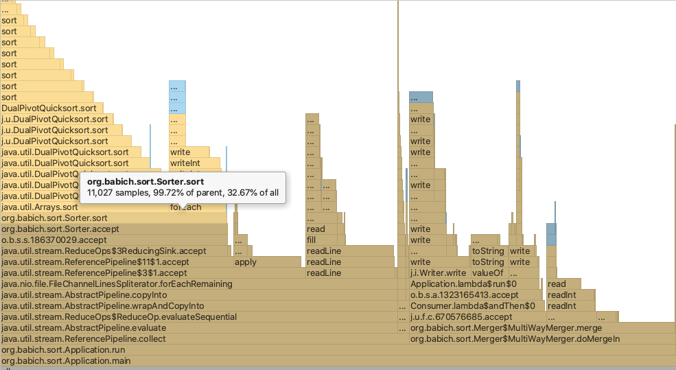
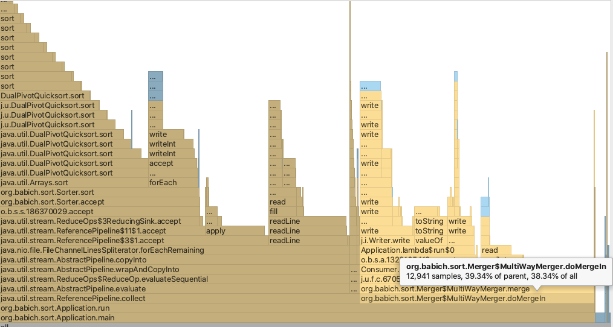

# External sorting

Given with a line separated text file of integers ranging anywhere from Integer.MIN to
Integer.MAX of size 1024MB, the program should be able to produce line separated text
file which has the sorted content of the input file.

### Following preconditions
 + The program should be able to run with a memory constraint of 100MB i.e. the
-Xmx100m.
 + The file can have duplicate integers.
 + The text in the file has only integers which are line separated and no other
characters.

### Expectations
 + A running java program to solve the problem
 + Proper JUnit test-cases for the program.
 + Maven or Gradle build scripts with the project to run it
 + Sharing the project on some repository preferably Github.
 
 
 ## Getting Start
 This section contains instructions on running localy.
 
 ### Building and running Application
 1. Clone this repository.
 1. Compile the Application.
 
     `mvn clean install -DskipTests`
     
 1. Start the Application.
 
    `java -jar ./external-sorting-1.0-SNAPSHOT-jar-with-dependencies.jar [-help] [-incomingData] [-result] [-batchSize]`
    
    usage available arguments:
     ``` 
     usage: java -jar external-sorting-{version}.jar [-help] [-incomingData] [-result] [-batchSize]
      -batchSize <arg>      batchSize is the number of items that can be processed in memory default 5_000_000.
      -help                 print this message
      -incomingData <arg>   Path to location of the file with incoming data.
      -result <arg>         Path to the location of the file with outgoing data by default application directory.
     ``` 
     
     example
      ``` 
     bash-3.2$ java -jar ./external-sorting-1.0-SNAPSHOT-jar-with-dependencies.jar -incomingData ~/tmp/random-int.txt -result ~/tmp/sorted-int.txt -batchSize 10000000
    
     initializing..
     started sorting data from {~/tmp/random-int.txt}
     the result will be placed in {~/tmp/sorted-int.txt}
     batch size of processed elements in memory: 10000000
     Total items found in the incoming data file:100000000
     Total items were put in the result:100000000
     sorting data completed.
     
     Shutting down ...
     ``` 
    
    ### Profiling results
    Sorting takes 30% of the time.
    
    
    Merging and outputting the result takes 30% of the time.
    